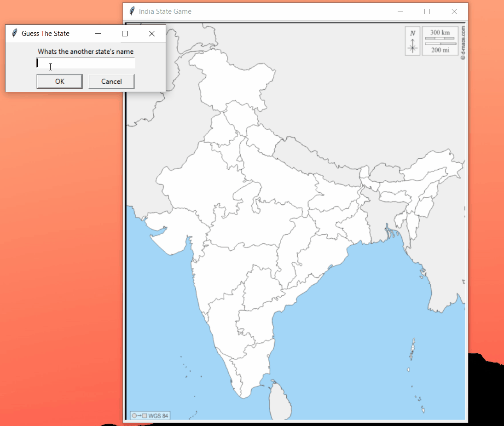

# Indian States Quiz Game

## Python package used: PythonTurtle

## Gameplay

With 28 states and 8 union territories in total, there are a lot of geography facts to learn about the Indian territories. This map quiz game is here to help. 
Type the name of State or UT to get started.

## Game controls 

### Type "exit" to to close the game 
